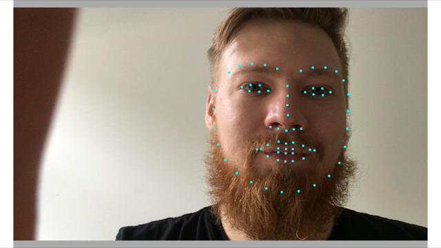

# Face Landmarking on iPhone

This prototype shows basic face landmark recognition on a ```CMSampleBuffer``` (see ```DlibWrapper.mm```) coming out of an ```AVCaptureSession```.

Frame rate is actually quite good on an iPhone 6S now that we are using the system face detection via ```AVCaptureMetadataOutput```.
I did not measure performance yet but there is no discernible lag anymore. It looks like 30fps. 

But I am sure there are a lot more performance improvements to be made. Currently, the buffers are copied around a lot.

## Screenshot



## Credits

This app uses the Dlib library (<http://dlib.net>) and their default face landmarking model file downloaded from <http://dlib.net/files/shape_predictor_68_face_landmarks.dat.bz2>. Thanks for the great work.

This project includes a precompiled Dlib. If you want to change something, consider that the ```Preprocessor Macros``` in the project linking Dlib need to be the same as the ```Compiler Flags``` when building the lib.

The project to build Dlib on iOS was generated according to [these](http://stackoverflow.com/a/35058969/972993) instructions. 

Thanks to Satya Mallick from [learnopencv.com](http://www.learnopencv.com). He recommended using the system face detector to me.

## License

Code (except for ```DisplayLiveSamples/lib/*```) is released under MIT license.